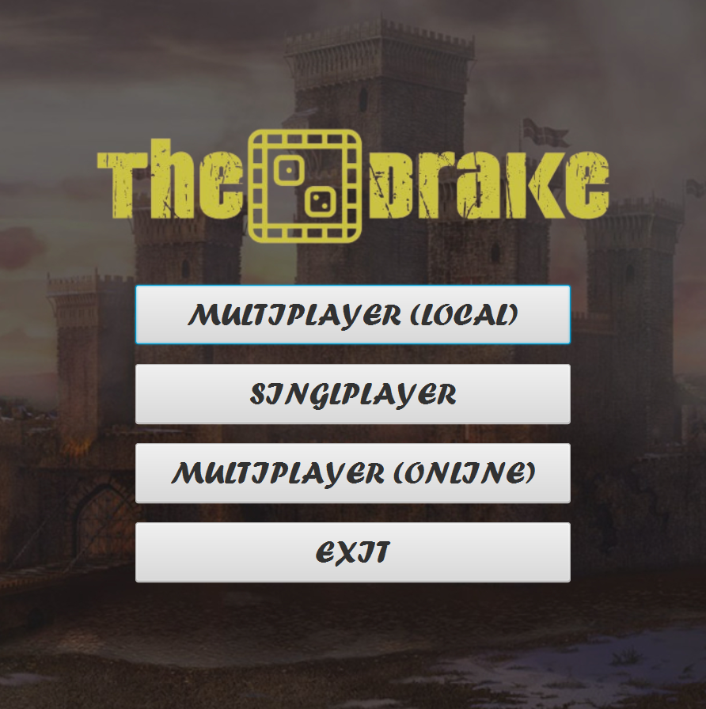
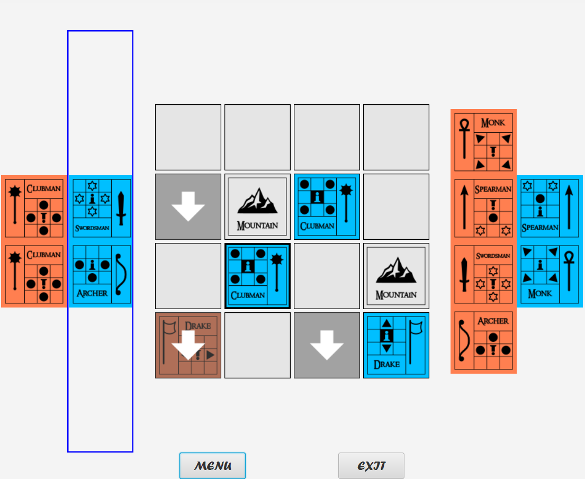

## Disclamer
This repository contains the code for the semester project of the subject [Programming in Java](https://courses.fit.cvut.cz/BI-PA2/) studied during the third semester at the Czech Technical University in Prague.

# The Drake
The goal of the semester project was to create a card game with a user interface and the ability to play two players on a single computer.

The Drake is a board game for two players inspired by existing game The Duke. The Duke somehow resembles chess and the Drake is basically a simplified version of The Duke.

## Work examples:
### Main menu:

### Game board
